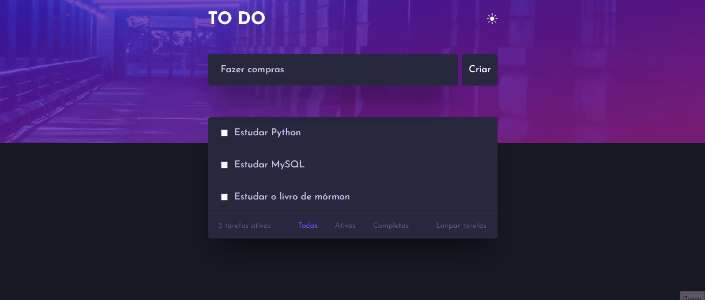
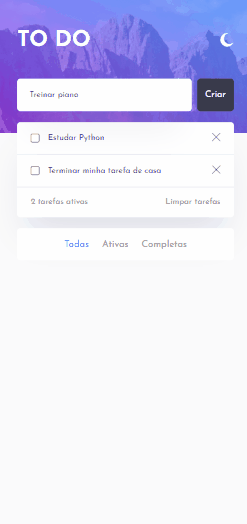

<h1 align="center">
    📝 To-Do Web App
</h1>

Welcome to my To-Do web application! This is a simple and intuitive task manager that allows users to create, view, and manage their to-do lists efficiently.

    </img>
    </img>

## 🚀 Key Features 

- Task Addition: Easily create new tasks by providing a title and an optional description.

- View Pending and Completed Tasks: Get a clear view of your pending tasks and those already completed, keeping yourself organized.

- Task Removal: Remove completed tasks or those no longer needed with just one click.

- Intuitive and Responsive Interface: Enjoy a user-friendly experience on both mobile devices and desktops, providing convenience wherever you are.

## ⚙️ How to Use

- Add a Task: Click on the "Add Task" button to insert a new task. Fill in the required fields and, if desired, add a detailed description.

- View Tasks: Navigate through the "Pending" and "Completed" sections to see your tasks organized by status.

- Remove Task: When a task is completed or no longer needed, use the corresponding option to remove it from the list.

- Stay Organized: Keep your tasks organized by focusing on pending 

## Technologies Used 💻

- ✅ Node.js

- ✅ Express.js

- ✅ Express-Handlebars

- ✅ MySQL2

- ✅ HTML, CSS, JavaScript

- ✅ CSS

- ✅ Josefin Sans

- ✅ MySQL

- ✅ Git

- ✅ Docker

- ✅ Fetch API

Made with ♥ by MATHEUS PC :wave: [Get in Touch!](https://www.likedin.com/in/matheus-estevan)